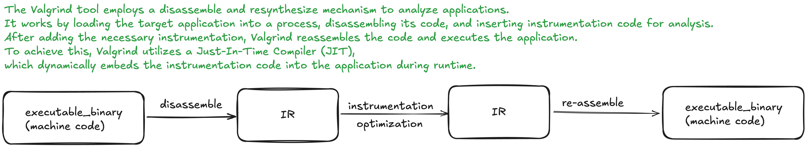

# Memory Management in C++: Tools to Prevent Leaks
Memory management in C++ is a critical yet challenging aspect of development, especially when manually allocating and deallocating memory. Relying solely on developers to avoid memory leaks is not a reliable approach. To address this, tools like [valgrind](https://valgrind.org/info/tools.html#memcheck) and **AddressSanitizer (ASan)** are invaluable for detecting and preventing memory-related issues.

Below is a comparison of the key differences between  and ASan:

| **Feature**         | **Valgrind**                             | **AddressSanitizer (ASan)**             |
|-----------------|--------------------------------------|-------------------------------------|
| **Type**            | Dynamic analysis tool                | Compiler-integrated tool            |
| **Performance**     | Slower (runs in a virtual machine)   | Faster (compiled into the program)  |
| **Ease of Use**     | Requires no code changes             | Requires recompilation with flags   |
| **Detection Scope** | Broad (memory leaks, invalid access) | Focused (memory errors, leaks)      |
| **Platform Support**| Cross-platform (Linux, macOS, etc.)  | Primarily Linux, macOS, and Windows |


By leveraging these tools, developers can significantly reduce the risk of memory leaks and improve the overall stability of their applications.

# Build this demo:
```bash
cmake -S . -B build -GNinja
cmake --build build
./build/memory_leak
./build/safely_allocate_memory
```
